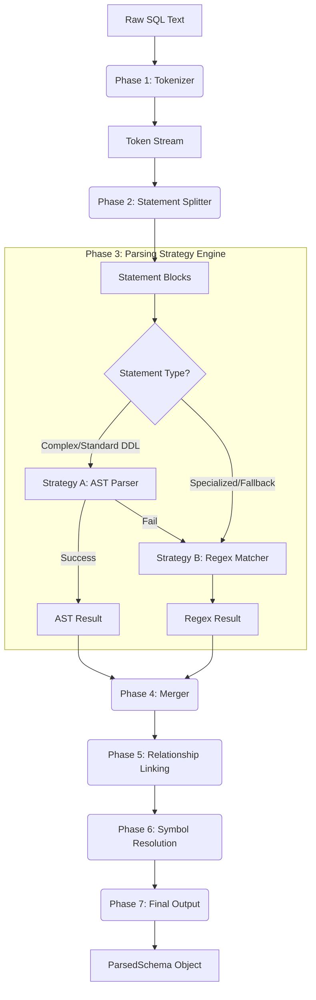
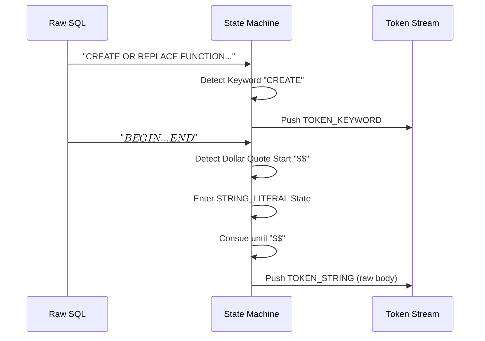
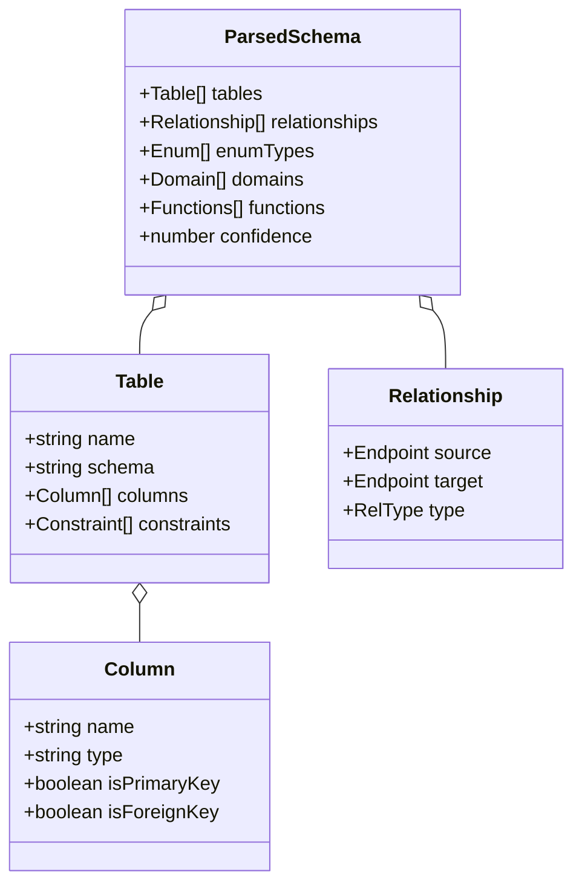

# SQL Parser Architecture Deep Dive (v2)

> **Version**: 3.0 (Architecture v2)  
> **Date**: January 2026  
> **System**: Schema Weaver SQL Engine

This document provides a comprehensive deep dive into the internal architecture of the Schema Weaver SQL Parser. It details the 7-phase processing pipeline, the dual-strategy parsing engine, and the error recovery mechanisms that allow it to handle complex enterprise DDL.

---

## 1. High-Level Architecture

The parser operates as a **Multi-Stage Pipeline** that transforms raw SQL text into a semantic Schema Object Model.



---

## 2. Core Processing Phases

### Phase 1: Context-Aware Tokenization

The tokenizer is not just a simple string splitter. It is a state machine that handles PostgreSQL specific syntax quirks.

*   **Responsibility**: Convert raw string into `Token[]`.
*   **Key Challenges handled**:
    *   **Dollar Quoting**: `$$` or `$tag$` for function bodies.
    *   **String Literals**: standard `'` and escaped `E' '`.
    *   **Comments**: `/* ... */` (nested) and `--`.
    *   **Operators**: Multi-character operators like `->>`, `~*`.



### Phase 2: Intelligent Statement Splitting

PostgreSQL allows complex procedural code (PL/pgSQL) inside statements. A simple split by `;` would break function bodies.

*   **Logic**:
    *   Track parenthesis depth `()`.
    *   Track block depth `BEGIN ... END`.
    *   Respect dollar quotes (contents are opaque).
    *   Only split on `;` when depth is zero.
*   **Classification**:
    *   Lookahead scanner identifies statement type (e.g., `CREATE_TABLE`, `CREATE_DOMAIN`).
    *   Extracts `namespace` (schema) upfront for context.

### Phase 3: The Dual-Strategy Engine

This is the core innovation enabling 95%+ confidence. We employ two distinct parsing strategies that compensate for each other's weaknesses.

#### Strategy A: Abstract Syntax Tree (AST)
*   **Engine**: `pgsql-ast-parser`
*   **Strengths**: 
    *   Mathematically correct parsing.
    *   Handles complex nested expressions.
    *   Validates syntax correctness.
*   **Weaknesses**:
    *   Fails on newer Postgres syntax (e.g., new Partitioning syntax).
    *   Strict (fails completely on minor syntax errors).

#### Strategy B: Pattern Matching (Regex)
*   **Engine**: Custom Regex Library (`strategy-pattern-match.ts`)
*   **Strengths**:
    *   Extremely robust against syntax errors.
    *   Can extract data even from malformed SQL.
    *   Easy to extend for new syntax (Composite Types, Domains).
*   **Weaknesses**:
    *   Can be fooled by complex nested structures (though improved in v3).

**Decision Logic**:
```typescript
if (isRegexPreferred(statementType)) {
    // Try Regex first (Indexes, Views, Domains)
    result = tryRegexParse();
    if (!result) result = tryAstParse();
} else {
    // Try AST first (Tables, Functions)
    result = tryAstParse();
    if (!result) result = tryRegexParse();
}
```

### Phase 4-6: Semantic Resolution

Once individual statements are parsed, we build the "Graph".

1.  **Merging (Phase 4)**: 
    *   Deduplicate results.
    *   Merge AST and Regex results if both partially succeeded.
2.  **Relationship Linking (Phase 5)**:
    *   **Foreign Keys**: Explicit `REFERENCES` constraints.
    *   **Implicit Links**: Name matching (e.g., `user_id` -> `users.id`) - *Configurable*.
    *   **Inheritance**: `INHERITS` and `PARTITION OF`.
3.  **Symbol Resolution (Phase 6)**:
    *   Resolve unqualified names (`users` -> `public.users` or `auth.users` based on `search_path`).
    *   Link Types to Columns (e.g., column type `status` links to Enum `status`).

---

## 3. Data Structures

The `ParsedSchema` object is the Source of Truth.



---

## 4. AI & LLM Integration

The parser serves as the "Bridge" between raw code and AI reasoning.

1.  **Context Reduction**: AI context windows are limited. Sending raw SQL for 100 tables is wasteful.
2.  **Semantic Compression**: The parser converts 1000 lines of SQL into a compact JSON schema.
3.  **Prompt Engineering**:
    *   The parser output helps generate "Schema Aware" system prompts.
    *   *"You are working with a schema that has partitioning on 'events' and RLS enabled on 'users'."*

---

## 5. Development Guide

### Adding a New Syntax Support

To support a new feature (e.g., `CREATE EVENT TRIGGER`):

1.  **Update Types**: Add `EventTrigger` interface in `core-types.ts`.
2.  **Update Splitter**: Add `CREATE_EVENT_TRIGGER` to `StatementType` in `phase-2-split.ts`.
3.  **Implement Strategy**:
    *   **Preferred**: Add Regex pattern in `strategy-pattern-match.ts`.
    *   **Complex**: Add AST handler in `strategy-ast-parser.ts` (if supported by lib).
4.  **Register Output**: Update `index.ts` to collect the new object in `ParseContext`.
5.  **Add Test**: Create a case in `advanced-parser-test.ts`.

### Debugging

Use the hidden debug flags in the console:

```typescript
// Enable debug logging for the parser
window.SchemaWeaver.debug = true;

// Inspect the last parse result
console.log(window.SchemaWeaver.lastParseResult);
```

---

*Documentation generated for Schema Weaver v3.0*
